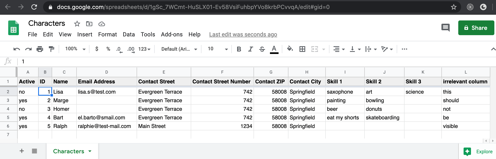

<p align="center">
  
</p>

# ng-google-sheets-db - Angular Google Sheets DB

[](https://github.com/FranzDiebold/ng-google-sheets-db-library/actions)
[](https://franzdiebold.github.io/ng-google-sheets-db-library/)
[](https://stackblitz.com/edit/ng-google-sheets-db-demo)
[](./projects/ng-google-sheets-db/package.json)
[](https://www.npmjs.com/package/ng-google-sheets-db)
[](https://www.npmjs.com/package/ng-google-sheets-db)
[](./LICENSE)

Use [Google Sheets](https://en.wikipedia.org/wiki/Google_Sheets) as your (read-only) backend for your Angular app!

[](https://docs.google.com/spreadsheets/d/1gSc_7WCmt-HuSLX01-Ev58VsiFuhbpYVo8krbPCvvqA)

```typescript
const attributesMapping = {
  id: "ID",
  name: "Name",
  email: "Email Address",
  contact: {
    _prefix: "Contact ",
    street: "Street",
    streetNumber: "Street Number",
    zip: "ZIP",
    city: "City",
  },
  skills: {
    _prefix: "Skill ",
    _listField: true,
  },
};
```

```ts
googleSheetsDbService
  .get(
    "1gSc_7WCmt-HuSLX01-Ev58VsiFuhbpYVo8krbPCvvqA",
    "Characters",
    attributesMapping
  )
  .subscribe((characters: object[]) => {
    // Use the characters here
  });
```

## Installation

```bash
ng add ng-google-sheets-db
```

or

```bash
npm install ng-google-sheets-db
```

## Usage

### Google Sheets

1. Create a [Google Sheet](https://docs.google.com/spreadsheets):
   - The first row **must** be the header.
   - The following rows are your entries, one entry per row.
   - You may have an _active_ column, with which you can enable or disable rows/entries.
   - A Google Sheets demo spreadsheet is available [here](https://docs.google.com/spreadsheets/d/1gSc_7WCmt-HuSLX01-Ev58VsiFuhbpYVo8krbPCvvqA).
2. Share your sheet:
   - [File] &rightarrow; [Share] &rightarrow; On the bottom of the modal at "Get Link" click [Change to anyone with the link] to be "Viewer".
   - Get the _Spreadsheet ID_ (i.e. `1gSc_7WCmt-HuSLX01-Ev58VsiFuhbpYVo8krbPCvvqA`): It is part of the Google spreadsheet URL.
   - Get the _Sheet Name_: The name of the worksheet can be found at the bottom of your Google spreadsheet.
3. Optional: It may be a good idea to enable [2-Step Verification](https://www.google.com/landing/2step/) for your Google account, if you have not done it yet :wink:.

### Google Cloud Platform (GCP)

A good overview guide is the [Get started as a Workspace developer](https://developers.google.com/workspace/guides/getstarted-overview).

1. Create a new project in the [Google Cloud Console](https://console.cloud.google.com/).
2. Enable Google Sheets API: [APIs & Services] &rightarrow; [Enable APIs and Services] &rightarrow; Search for "Google Sheets API" &rightarrow; [ENABLE].
3. Create an _API key_: [APIs & Services] &rightarrow; [Credentials] &rightarrow; [+ CREATE CREDENTIALS] &rightarrow; [API key] &rightarrow; [RESTRICT KEY] &rightarrow; In "Application restrictions" choose "HTTP referrers (web sites)" with "Website restrictions" and in "API restrictions" choose "Restrict key" and select "Google Sheets API" &rightarrow; [SAVE].
4. Get the generated API key.

### Angular

Add `GoogleSheetsDbService` to your app's module as a provider and Angular's `HttpClientModule` to the imports:

```typescript
import { HttpClientModule } from '@angular/common/http';

import { API_KEY, GoogleSheetsDbService } from 'ng-google-sheets-db';

@NgModule({
  ...
  imports: [
    HttpClientModule,
    ...
  ],
  providers: [
    {
      provide: API_KEY,
      useValue: <YOUR_GOOGLE_SHEETS_API_KEY>,
    },
    GoogleSheetsDbService
  ],
  ...
})
export class AppModule { }
```

Import and inject into your component's constructor:

```typescript
import { GoogleSheetsDbService } from 'ng-google-sheets-db';

@Component({
  ...
})
export class YourComponent implements OnInit {
  characters$: Observable<Character[]>;

  constructor(private googleSheetsDbService: GoogleSheetsDbService) { }

  ngOnInit(): void {
    this.characters$ = this.googleSheetsDbService.get<Character>('1gSc_7WCmt-HuSLX01-Ev58VsiFuhbpYVo8krbPCvvqA', "Characters", characterAttributesMapping);
  }
```

### Attributes Mapping

The `attributesMapping` maps the Google spreadsheet columns to to your outcome object.

```typescript
const attributesMapping = {
  id: "ID",
  name: "Name",
  email: "Email Address",
  contact: {
    _prefix: "Contact ",
    street: "Street",
    streetNumber: "Street Number",
    zip: "ZIP",
    city: "City",
  },
  skills: {
    _prefix: "Skill ",
    _listField: true,
  },
};
```

For example, the Google spreadsheet column _Email Address_ is mapped to the outcome object attribute `email`.

#### Nested objects

`contact` is an example of a nested object. You may define a `_prefix` as a prefix for all columns of the nested object. Please note that the `_prefix` may need a trailing whitespace.

#### Lists

`skills` is an example of a list. You need to set `_listField` and a `_prefix` for all columns of the list. In this example, all columns starting with _Skill _ and an increasing number are part of the list, i.e. _Skill 1_, _Skill 2_, etc. Please note that the `_prefix` may need a trailing whitespace.

## Methods

### get<T>(spreadsheetId: string, worksheetName: string, attributesMapping: object | string[]): Observable<T[]>

```typescript
const allCharacters$: Observable<Character> =
  googleSheetsDbService.get<Character>(
    "1gSc_7WCmt-HuSLX01-Ev58VsiFuhbpYVo8krbPCvvqA",
    "Characters",
    attributesMapping
  );
```

Get all rows from the Google spreadsheet as an `Observable` of objects or a given type as type variable `T`.

### getActive<T>(spreadsheetId: string, worksheetName: string, attributesMapping: object | string[], isActiveColumnName: string = 'is_active', activeValues: string[] | string = null): Observable<T[]>

```typescript
const activeCharacters$: Observable<Character> =
  googleSheetsDbService.getActive<Character>(
    "1gSc_7WCmt-HuSLX01-Ev58VsiFuhbpYVo8krbPCvvqA",
    "Characters",
    attributesMapping,
    "Active"
  );
```

Get "active" rows from the Google spreadsheet as an `Observable` of objects or a given type as type variable `T`. You may have an _active_ column with name `isActiveColumnName`, with which you can enable or disable rows/entries.
"Active" rows have the value `true`, `1` or `yes`. You may also define your own `activeValues`.

## Demo Application

Want to see an example of how to use `ng-google-sheets-db`? Check out the demo application in [projects/demo](./projects/demo) or on [StackBlitz](https://stackblitz.com/edit/ng-google-sheets-db-demo).

## License

[MIT](./LICENSE)
